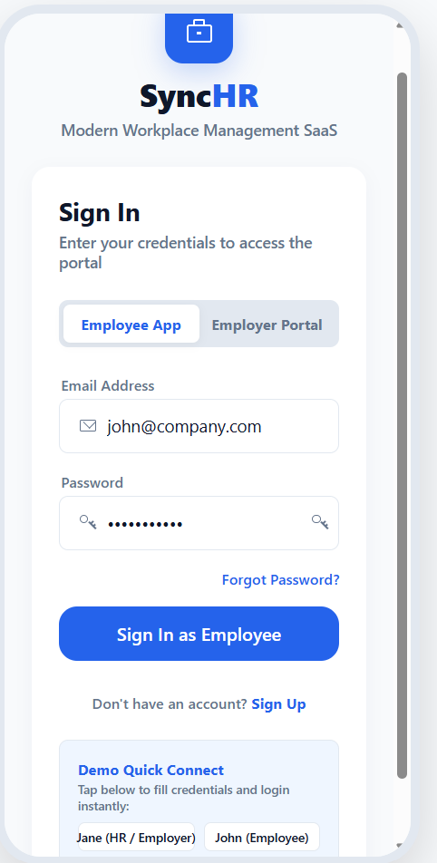
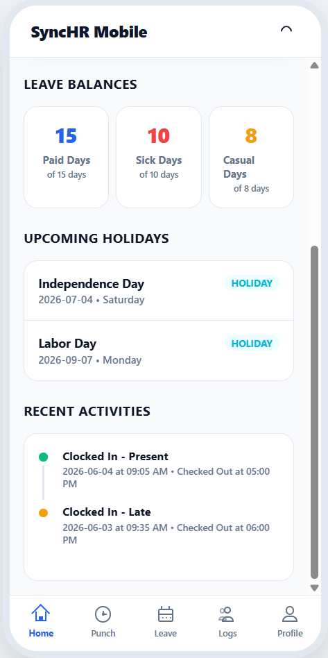
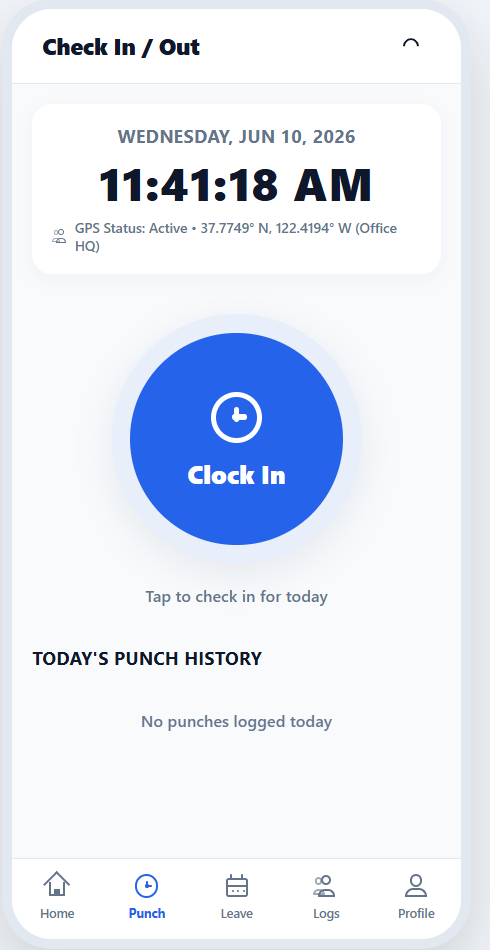
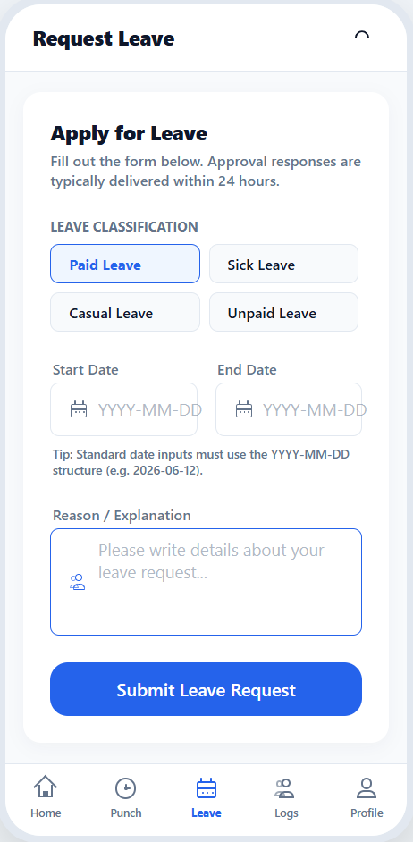
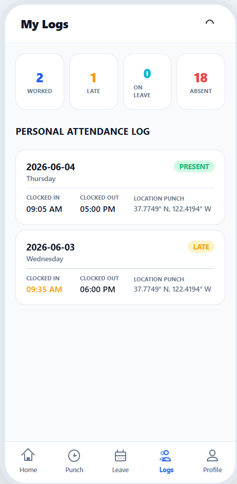
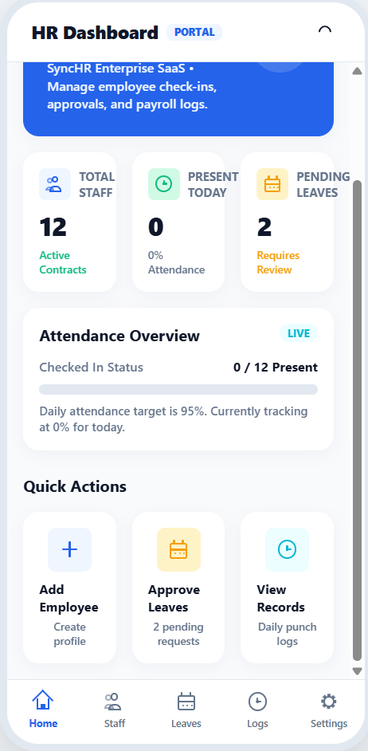
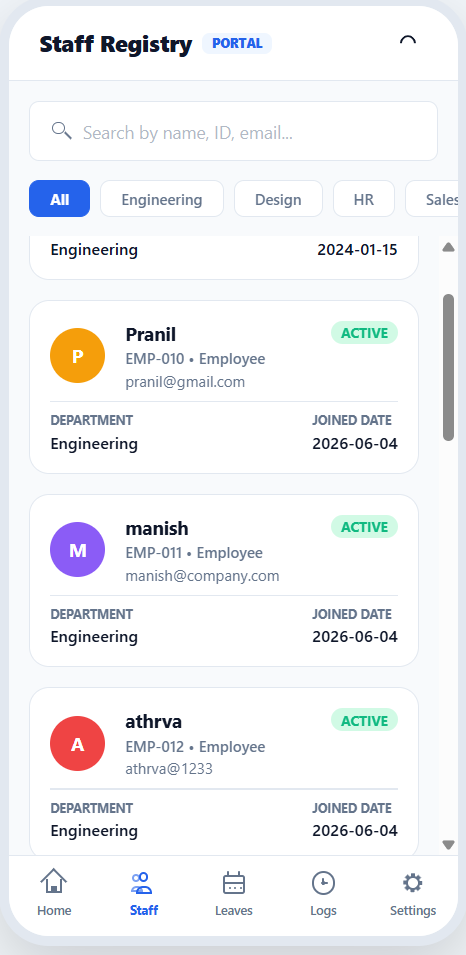
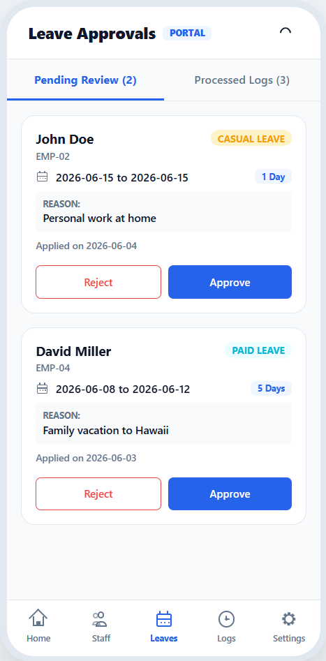
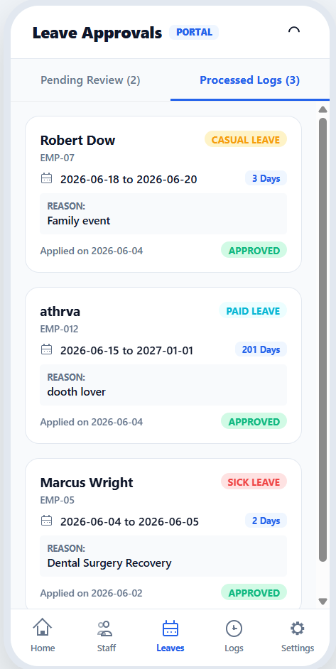
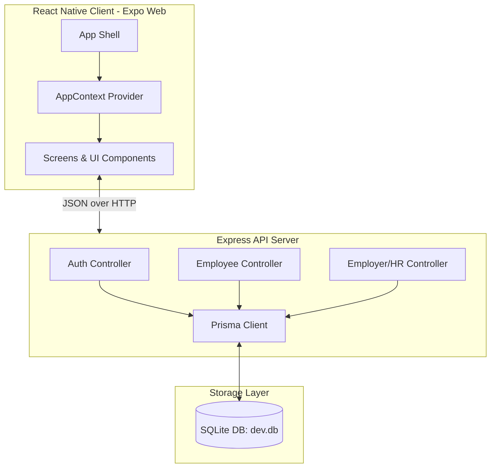

# SyncHR 🚀 | Modern Workplace & SaaS HR Management Portal

SyncHR is a sleek, modern, and responsive SaaS workplace management platform designed for managing attendance, check-ins, and leaves. It consists of a **React Native (Expo)** mobile-web frontend and a **Node.js/Express** backend backed by a **Prisma/SQLite** database.

---

## 📸 Screenshots Gallery

Here is a comprehensive visual walkthrough of the SyncHR application portals:

### 🔐 Authentication Portal
| **Unified Portal Login** |
|:---:|
|  |

### 👤 Employee Mobile App
| **Dashboard** | **Punch In/Out** | **Request Leave** | **Attendance History** |
|:---:|:---:|:---:|:---:|
|  |  |  |  |

### 🏢 Employer / HR Portal
| **Live HR Dashboard** | **Staff Registry** | **Pending Approvals** | **Processed Leave Logs** |
|:---:|:---:|:---:|:---:|
|  |  |  |  |

---

## ✨ Features

### 👤 Employee Portal
* **One-Tap Punch**: Easy check-in/out logging with GPS coordinates (simulated).
* **Leave Requests**: Request Paid, Sick, Casual, or Unpaid leaves with real-time status tracking.
* **Attendance History**: Access past check-in/out times, logs, and active statuses.
* **Profile Settings**: View employee details, department classification, and join dates.

### 🏢 Employer/HR Portal
* **Live Analytics**: View live statistics on active staff, on-leave employees, and pending leave approvals.
* **Staff Registry**: Complete CRUD interface for registering and managing workforce profiles.
* **Leave Approvals**: Instant approval or rejection of employee leave request tickets.
* **Daily Logs**: Audit and view attendance records of all workers for the day.

---

## 🛠️ Technology Stack

* **Frontend**: React Native, Expo (v56), React 19, TypeScript, Expo Router (file-based routing).
* **Backend**: Node.js, Express, TypeScript, JWT (JSON Web Tokens), Bcrypt encryption.
* **Database & ORM**: Prisma ORM with a local SQLite database setup.

---

## 🏛️ System Architecture

### Component Diagram



### Directory Structure

```
StickerSmash/
├── assets/                 # App icons, logos, and presentation assets
├── backend/                # Node.js/Express Backend Server
│   ├── prisma/             # Prisma Schema & Database setup
│   │   ├── schema.prisma   # SQLite tables configuration
│   │   ├── dev.db          # Database file
│   │   └── seed.ts         # Initial mock data seeder
│   └── src/                # Backend API source files
│       ├── controllers/    # Route controllers (Auth, Employee, HR)
│       └── server.ts       # Express server entrypoint
├── screenshots/            # Showcase screenshots for GitHub
├── src/                    # Expo Mobile/Web Frontend
│   ├── app/                # Expo Router files (_layout, index, explore)
│   ├── components/         # Reusable widgets and screen layouts
│   │   ├── screens/        # Main application screens (Login, Dashboards)
│   │   └── ui/             # Core visual primitives (Buttons, Cards, Inputs)
│   ├── constants/          # Styles and HSL color theme configuration
│   ├── context/            # Global context (Authentication, State Sync)
│   └── hooks/              # Custom React hooks (useTheme)
├── package.json            # Root configuration and dependencies
└── tsconfig.json           # Frontend TypeScript path mappings
```

---

## 💾 Database Schema

The SQLite schema uses the following relational structure configured via Prisma:

* **User**: Credential records containing JWT identity authentication (roles: `Employee`, `HR`, `Admin`).
* **Employee**: Complete profile details linked to the `User` account.
* **Attendance**: Daily punch-in (`checkIn`), punch-out (`checkOut`) coordinates, dates, and active status logs.
* **Leave**: Submissions for Paid, Sick, Casual, and Unpaid leave requests with approval status tracker.
* **Holiday**: National corporate calendar lookup registry.

---

## 🚀 Getting Started

### 1. Prerequisite Setup
Ensure you have [Node.js](https://nodejs.org) installed on your machine.

### 2. Install Dependencies
Install packages for both the frontend and backend:

```bash
# Install root (Frontend) dependencies
npm install

# Install backend dependencies
cd backend
npm install
cd ..
```

### 3. Run the Backend API Server
Configure the environment variables in `backend/.env` (default template is configured with SQLite), then start the server:

```bash
cd backend
# (Optional) Seed the database with sample profiles:
# npm run prisma:migrate
# npm run prisma:seed

# Start node server in dev mode
npm run dev
```
The server will boot on `http://localhost:5000`.

### 4. Run the Expo Web Application
In the root directory, start the Metro Bundler web server:

```bash
npm run web
```
The application will launch on [http://localhost:8081](http://localhost:8081).

---

## 💡 Quick Login Demo Accounts
Use the quick connect buttons on the login screen, or sign in using:
* **HR Admin**: `jane@company.com` / `password123`
* **Employee**: `john@company.com` / `password123`


